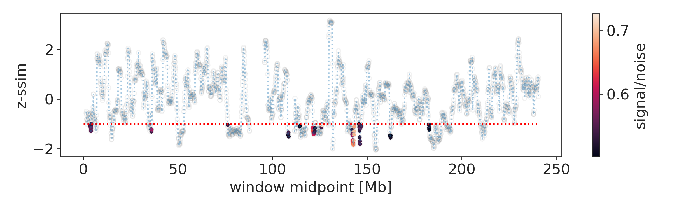
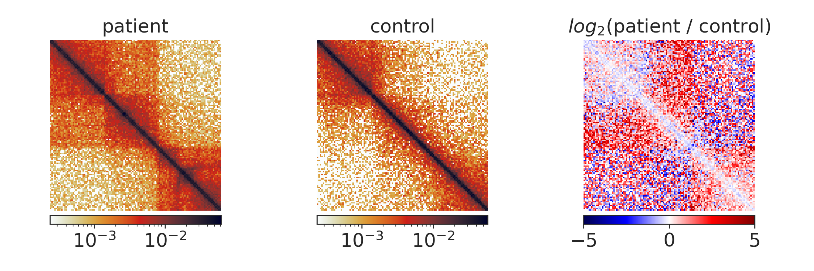
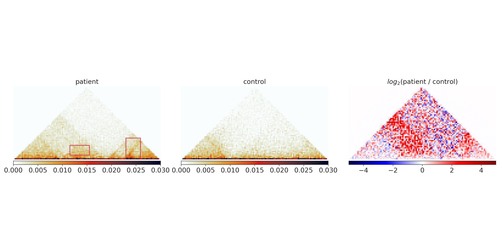

****************
Example analysis
****************

CHESS has two typical use-cases, which are showcased in the publication (ADD LINK):

1. Finding genomic regions with differences in their chromatin conformation between
   two samples. This is useful for example for the identification of
   disease driving changes.

2. Comparing the chromatin conformation between two distinct regions in the same
   or in different genomes. This is useful for example for quantifying the grade
   of conservation of chromatin conformation in evolution.

===========================================================
Finding differences between samples of different conditions
===========================================================

This example illustrates how CHESS can help to identify genomic regions
that differ in their chromatin conformation between two samples, by the
example of samples from a `DLBCL <https://en.wikipedia.org/wiki/Diffuse_large_B-cell_lymphoma>`
patient and a control person. The analysis of these data is also showcased in
the `chess paper <SOME LINK>`, Figure 5.

For this analysis, we will need only three input files for CHESS:

1. Balanced Hi-C data for the first sample
2. Balanced Hi-C data for the second sample
3. The coordinates of the regions that should be compared in bedpe format.

1. and 2. can be in `Juicer <https://github.com/aidenlab/juicer>`_,
`Cooler <https://github.com/mirnylab/cooler>`_ or `FANC <https://github.com/vaquerizaslab/fanc>`_ format.
However, we advice to use Juicer of FANC files for performance reasons.

3. should be supplied in `BEDPE <https://bedtools.readthedocs.io/en/latest/content/general-usage.html#bedpe-format>`_
format.

If we want to scan a whole chromosome or genome for differences,
we can use the :ref:`chess pairs <chess-pairs>` subcommand to generate the
3. input file.

To follow along with the example analysis, first move to the data location:

.. code:: bash

  cd examples/dlbcl

-----------------------------
Generating a pairs input file
-----------------------------

In this example analysis, we will search the entire chromosome 2 for differences.
For this, we first need to generate the pairs file with the
:ref:`chess pairs <chess-pairs>` subcommand.
We will compare regions of 3 Mb size with a step size of 100 kb.
In addition, ``chess pairs`` needs to know the sizes of the chromosomes for which
we want to generate the pairs. Here we supply 'hg38' as an genome identifier:

.. code:: bash

  chess pairs hg38 3000000 100000 \
  ./hg38_chr2_3mb_win_100kb_step.bed --chromosome chr2

------------------
Running the search
------------------

With all necessary input files prepared, we can run the search with
the :ref:`chess sim <chess-sim>` subcommand:

.. code:: bash

  chess sim \
  ukm_control_fixed_le_25kb_chr2.hic \
  ukm_patient_fixed_le_25kb_chr2.hic \
  hg38_chr2_3mb_win_100kb_step.bed \
  ukm_chr2_3mb_control_vs_patient_chess_results.tsv

The output data are stored in the
ukm_chr2_3mb_control_vs_patient_chess_results.tsv file.

----------------------
Inspecting the results
----------------------

To inspect which regions show differences between the two samples,
it is useful to first inspect the similarity index along the compared
chromosome. Aside from the calculated similarity index, the signal-to-noise
ratio is important. One way to display this information together is this
(please check out the jupyter notebook at `examples/dlbcl/example_analysis.ipynb`
for the code to generate these plots and subset data):

Here we display only regions with a signal-to-noise ration > 0.5 and a
z-normalised similarity score < -1 as colored dots, the rest is gray.
The most interesting regions are highlighted by
deep dips with above threshold signal-to-noise ratios, for example the
region around 148 Mb:

-------------------
Extracting features
-------------------

We now might want to highlight the features in these regions that show
particularly strong differences. This can be done with the
:ref:`chess extract <chess-extract>` command. To use it, we first need to decide
on a subset of regions that contain strong differences, e.g. by filtering with
the signal-to-noise > 0.5 and z-ssim < -1 cutoffs used above (see the jupyter
notebook for subsetting code). We then prepare an output directory

.. code:: bash

  mkdir features

and then run :ref:`chess extract <chess-extract>`:

.. code:: bash

  chess extract \
  filtered_regions_chr2_3mb_100kb.tsv \
  ukm_control_fixed_le_25kb_chr2.hic \
  ukm_patient_fixed_le_25kb_chr2.hic \
  ./features

We are here using the command with default parameters. 
Please note that the input parameters have to be fine tuned depending on the
size of the analyzed regions and the target features.
For now, some experimentation by the user is required, but we are planning to 
release a guide to this in the future.

In our example region, the following parts are marked by the extraction
algorithm in default mode, marking the differential TAD structures:

--------------------
Classifying features
--------------------

Finally, we can gain more information about the kind of features that we
extracted in the previous step by grouping them by similarity of their
topology. This can be done with the
:ref:`chess crosscorrelate <chess-crosscorrelate>` command, which we can simply
apply to the result files of the previous step. E.g. to classify the gained
features, we run

.. code:: bash

  chess crosscorrelate \
  features/gained_features.tsv \
  filtered_regions_chr2_3mb_1mb.tsv \
  ./features/

We obtain ./features/subregions_2_clusters_gained.tsv, where the 2 corresponds
to the 2 clusters identified in this analysis. The results file has three columns:
the cluster number, the region id and the feature id. Using the feature id
column, each feature in the input file (features/gained_features.tsv) can be
mapped to its class.

----------------------
Choosing a window size
----------------------

In this analysis, we compared windows of 3 Mb size between our samples.
In general, choosing a different window size should be correlated,
with large windows simply averaging over the effects observed in smaller
windows.

Despite the correlation, different window sizes can yield different results
in some regions:

* Larger windows cover more and longer long-range interactions;
  - If you are interested in changes of large effects stretching over 
    long genomic distances, choose a larger window size.
  - However, long-range interactions tend to be more noisy.
    The larger the window size, the smaller the number of regions that will
    pass a given signal-to-noise threshold. If your analysis does not return
    any regions of strong dissimilarity above your signal-to-noise threshold,
    lower the threshold or try a smaller window size.
* The larger the window, the smaller the effect of small changes;
  - If you are interested in finding changes in single TAD boundaries, 
    choose a small window. Large windows will cover multiple boundaries 
    and the score of the window will reflect their combined change.
