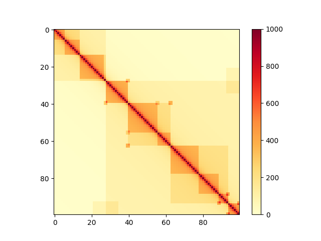

# Utils

This directory contains accompanying scripts to our [CHESS publication](bioRxiv link).

<!-- TOC depthFrom:1 depthTo:8 withLinks:1 updateOnSave:1 orderedList:0 -->

- [Utils](#utils)
    - [Generation of synthetic Hi-C matrices](#generation-of-synthetic-matrices)
    - [Testing CHESS on synthetic data](#testing-chess-on-synthetic-data)

<!-- /TOC -->

## Generation of synthetic Hi-C matrices

`make_synthetic_references.py` generates synthetic Hi-C matrices with a signal decay away from the main diagonal following a power law and features resembling TADs and loops.

```bash
./make_synthetic_references.py <workdir> -n N -b B
```

where `N` sets the number of matrices and `B` their edge length.

The output is written to `workdir` and consists of three files:

* `N`_test_reference_matrices_`B`bins.npy, an array containing the full synthetic matrices in numpy format.

* `N`_test_reference_boundaries_`B`bins.npy, an array with the positions of TAD boundaries for the generated matrices, in the same order as the matrices file.
  For each matrix, there is an entry with three lists corresponding to three layers of TADs, large to small.

* `N`_test_reference_loops_`B`bins.npy, an array with the intensities and relative sizes of loops in the corners of the TADs defined in the boundaries file, in the same order.

You can load any of these files into python like this:

```python
import numpy as np
from matplotlib import pyplot as plt

# matrix file generated with ./make_synthetic_references.py ./ -n 10 -b 100
file = './10_test_reference_matrices_100bins.npy'

matrices = np.load(file)

# load the first matrix
matrix_1 = matrices[0]

# plot matrix and save plot
plt.figure()
plt.imshow(matrix_1, cmap='YlOrRd', vmin=0, vmax=1000)
plt.colorbar()
plt.savefig('example_matrix.png')
```

Your example_matrix.png might then look similar to this:




## Testing CHESS on synthetic data

The output from `make_synthetic_references.py` can be used as input to `run_synthetic_test.py` to test the performance of CHESS under controlled conditions, as demonstrated in our [manuscript](bioRxiv link).

```bash
./run_synthetic_test.py <matrices_file> <boundaries_file> <loops_file> <output_file> [... optional parameters]
```

Run `./run_synthetic_test.py -h` for an overview of the optional parameters that let you control the noise, simulated sequencing depth, size of query matrices and more.
